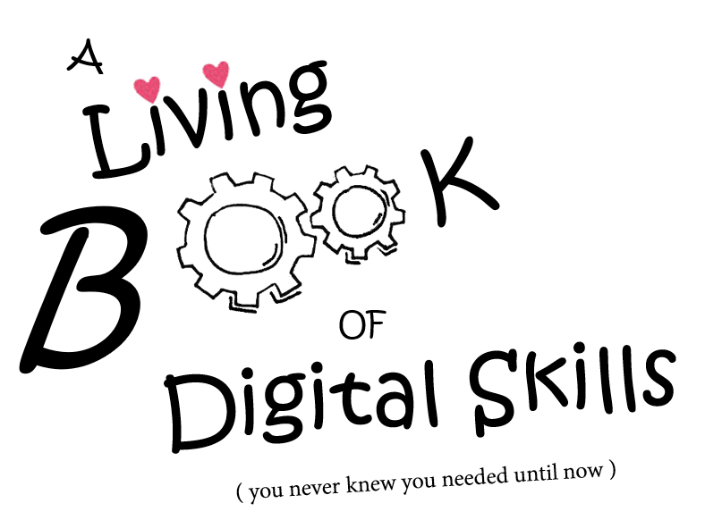

# Digital Skills GitBook

The Living Book of Digital Skills \(You never knew you needed until now\) is a living, open source online guide to 'modern not-quite-technical computer skills' for researchers and the broader academic community.

A collaboration between Australia's Academic Research Network \(AARNet\) and the Council of Australian Librarians \(CAUL\), this book is the creation of the CAUL Digital Dexterity Champions and their communities.

# Contributors
