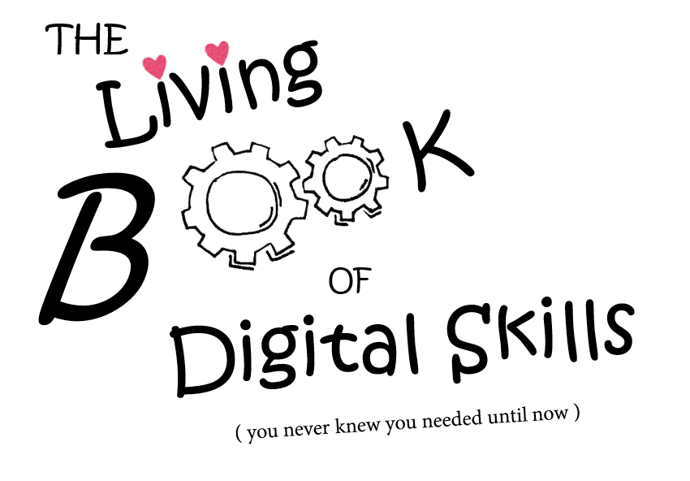

# Digital Skills GitBook

To all contributors, readers and community members, thank you for all of your support. It's been a great 5 years! 

## This project has now been sunsetted.

You can read our reflections in our case study published here: 

[Creating a collaborative open source, crowd-sourced educational resource: The Digital Skills GitBook project](https://oercollective.caul.edu.au/openedaustralasia/chapter/digital-skills-gitbook-project/)

The Living Book of Digital Skills (You never knew you needed until now) is a living, open source online guide to 'modern not-quite-technical computer skills' for researchers and the broader academic community.

A collaboration between Australia's Academic and Research Network (AARNet) and the Council of Australian University Librarians (CAUL), this book is the creation of the CAUL Digital Dexterity Champions and their communities.

## Contributors

<!-- ALL-CONTRIBUTORS-LIST:START - Do not remove or modify this section -->
<!-- prettier-ignore-start -->
<!-- markdownlint-disable -->

<!-- markdownlint-restore -->
<!-- prettier-ignore-end -->

<!-- ALL-CONTRIBUTORS-LIST:END -->

<!-- ALL-CONTRIBUTORS-BADGE:START - Do not remove or modify this section -->

<!-- ALL-CONTRIBUTORS-BADGE:END --> 

Thanks goes to these wonderful people ([emoji key](https://allcontributors.org/docs/en/emoji-key)):

This project follows the [all-contributors](https://github.com/all-contributors/all-contributors) specification. Contributions of any kind welcome!
